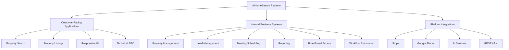

# Engineering Scope

```mermaid
flowchart TD

    A[AiHomeSearch Platform]

    A --> B[Customer-Facing Applications]
    A --> C[Internal Business Systems]
    A --> D[Platform Integrations]

    B --> B1[Property Search]
    B --> B2[Property Listings]
    B --> B3[Responsive UI]
    B --> B4[Technical SEO]

    C --> C1[Property Management]
    C --> C2[Lead Management]
    C --> C3[Meeting Scheduling]
    C --> C4[Reporting]
    C --> C5[Role-Based Access]
    C --> C6[Workflow Automation]

    D --> D1[Stripe]
    D --> D2[Google Places]
    D --> D3[AI Services]
    D --> D4[REST APIs]
```
